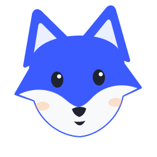
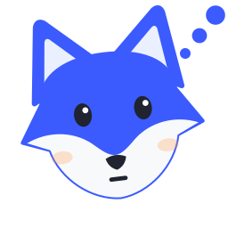
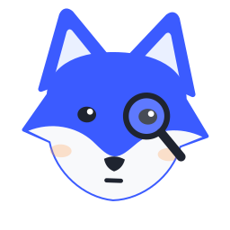

# Visual system

This page covers Covi's visual identity: the fox mascot and its expressions and animations, the palette, the light and dark themes, typography, motion, the generated assets, and rules for using them. Everything here is defined in code in `packages/brand` (`tokens.ts` and `mascot.ts`). That package has no dependencies and runs both in Node and in the browser runtime that draws video frames.

## The fox

<p>
  
</p>

Covi's narrator is a fox head made from a handful of flat shapes: two pointed ears, a rounded head with cheek points, a pale face mask, two eyes, a nose, and a mouth. There are no gradients, fur texture, or body. The simplicity is deliberate. The fox has to read clearly as a small narrator in the corner of a video frame and still work as a 32 px icon.

The fox is cobalt, not a conventional orange fox:

| Part | Color |
|---|---|
| Fur (head and ears) | cobalt `#3B5BFF` |
| Face mask | paper `#F8F9FB` |
| Inner ears | sky `#EAF0FF` |
| Eyes, nose, mouth | charcoal `#1F2430` |
| Eye highlights | white `#FFFFFF` |
| Cheek blush (28% opacity) and the warning badge | accent `#FF9A4A` |

Orange shows up only in small touches. A test (`packages/brand/test/mascot.test.ts`) checks that cobalt outweighs the accent in the rendered SVG. The fox keeps the same colors in both themes.

Every fox is drawn by one function, `foxSvg(options)`, on a fixed 128×128 view box. Expressions and animations are all parameters, so the same code produces a static asset or one frame of a talking, blinking narrator. Each SVG has `role="img"` and a `<title>` such as "Covi the fox (reviewing)".

| Option | Range | Effect |
|---|---|---|
| `expression` | see below | Eye shape, mouth, head tilt, ear angle, default gaze, and prop |
| `size` | px | Rendered width and height |
| `blink` | 0–1 | 0 = eyes open, 1 = closed |
| `mouth` | 0–1 | 0 = the expression's resting mouth, above 0.05 an open talking mouth that grows with the value |
| `look` | x, y in −1…1 | Gaze direction (moves the pupils) |
| `tilt` | degrees | Head rotation; overrides the expression's tilt |
| `ears` | degrees | Ear rotation, positive turns the ears outward; overrides the expression's ear angle |
| `bounce` | view-box units | Vertical offset for nods and bounces |
| `props` | boolean | Show the expression's prop (default true) |
| `propReveal` | 0–1 | How far the prop has appeared (default 1): thought dots appear one after another, badges and the magnifier scale in; values a little above 1 overshoot a pop |
| `blush` | boolean | Cheek blush (default true) |
| `colors`, `title`, `attributes` | | Color overrides (`fur`, `mask`, `inner`, `ink`, `accent`, `highlight`), accessible title, extra attributes on the root `<svg>` (escaped) |

## Expressions

<table>
  <tr>
    <td align="center"><br><code>neutral</code></td>
    <td align="center"><br><code>explaining</code></td>
    <td align="center"><br><code>thinking</code></td>
    <td align="center"><br><code>reviewing</code></td>
    <td align="center"><br><code>warning</code></td>
    <td align="center"><br><code>success</code></td>
  </tr>
</table>

| Expression | Face | Prop | Used for |
|---|---|---|---|
| `neutral` | Round eyes, small smile | none | Static assets and the logo |
| `explaining` | Round eyes, open mouth, slight head tilt | none | The default for narrated scenes: context, what changed, the fix |
| `thinking` | Head tilted, eyes looking up and to the side, flat mouth | three thought dots | Problems and "before" states |
| `reviewing` | Narrowed eyes, flat mouth | magnifying glass over one eye | Findings, and summaries of changes that need attention |
| `warning` | Wide eyes, small round mouth, ears turned out | orange badge with an exclamation mark | Serious findings, and summaries of changes that need changes |
| `success` | Closed, smiling eyes and a grin | cobalt check badge | Verified fixes and summaries of changes that look good |

In Covi's output the mascot appears only in videos. Markdown reports and PR/MR comments are text only.

How a video picks the expression for each scene:

- Storytelling templates (`templates/stories/*.yml`) give each beat an expression, `explaining` by default. See [video](video.md).
- When Covi drafts a storyboard, the review outcome can override the template: the review scene switches to `warning` when the verdict is "needs changes" or the top finding is high severity.
- On the summary card the verdict decides: `success` for looks good, `reviewing` for needs attention, `warning` for needs changes.
- Agents that write their own storyboard set `expression` per scene. The `covi-video` skill describes when to use each.

## Animations

The seven named animations are defined once, in `foxPose()` (`packages/brand/src/animation.ts`, listed in `ANIMATIONS`). It turns an expression, the scene time, the narration level, and where the content is into the fox's parameters. The video runtime draws both the narrator and the large title and summary foxes from it. Every animation is a pure function of the frame time, so any frame can be rendered on its own and renders the same way every time (see [contributing](contributing.md#changing-video-components)). Tests in `packages/brand/test/mascot.test.ts` cover each one.

| Animation | How it works |
|---|---|
| Blink | Blink times are scheduled from the timeline's seed. The first blink lands 1.4–2.9 s in, then one every 2.6–4.4 s. Each blink takes 0.18 s and follows a sine curve on `blink`. |
| Talk | `mouth` follows the narration audio. Covi takes the RMS level per video frame, normalizes it to the loud end of the take, gates silence, and smooths it with a fast attack and a slower release. Captions-only videos use a synthetic syllable rhythm during each scene's speech window instead. |
| Look | Between 0.6 and 1.2 s into a content scene, the eyes move from the expression's resting gaze to the content (down and to the left of the narrator). On title and summary cards the fox looks ahead. |
| Think | With `thinking`, the head sways ±2.5° around its −7° tilt, the eyes stay up and to the side, and the three thought dots appear one after another between 0.2 and 1.4 s. |
| Alert | With `warning`, the ears flick (±2.2°, fading over 0.8 s), the head jolts up briefly in the first 0.35 s, and the orange badge pops in with a slight overshoot. |
| Approve | With `success`, the fox nods twice between 0.15 and 0.95 s while the check badge pops in. Videos of changes that look good end on it. |
| Point | The fox has no arms, so it points with its body. On content scenes (code, screenshots, before/after, interactions, API calls, terminal output, findings, diagrams), it leans toward the content once that is on screen (0.8–1.4 s) and keeps its eyes on it. Screenshot and interaction scenes add a cursor that travels to the click point, a click ripple, and a focus ring around the changed region. |

Two more movements keep the narrator alive. It springs in when a scene starts (scale 0.9 → 1) and bobs gently (±1.2 px sine). On title cards the large fox springs from 0.82 → 1.

The narrator sits at the top right of the header band, clear of the media region and the caption band: 156 units wide on vertical video, 132 on landscape, and 128 on square, where a unit is 1/1080 of the short side. It is hidden on title and summary scenes, which show a larger fox of their own. With `video.mascot: false`, no fox appears at all. Video QC warns when the narrator overlaps demonstrated content (`narrator-clear-of-content`).

## Palette

| Token | Hex | Role |
|---|---|---|
| `cobalt` | `#3B5BFF` | Identity: the fox's fur and the primary color in the light theme (eyebrows, progress bar, highlights) |
| `cobaltDeep` | `#2A43D1` | Function names and object keys in code shown on light cards |
| `sky` | `#EAF0FF` | Soft surfaces, inner ears, the light theme's `primarySoft` |
| `charcoal` | `#1F2430` | Text, the fox's features, the logo wordmark |
| `graphite` | `#4A5163` | Muted text in the light theme, comments in code on light cards |
| `line` | `#D9DEEA` | Borders and progress-bar tracks in the light theme |
| `paper` | `#F8F9FB` | Light background, the fox's face mask, the dark logo's wordmark |
| `white` | `#FFFFFF` | Light-theme surfaces (cards), eye highlights |
| `accent` | `#FF9A4A` | Optional warm accent for small highlights only: blush, the warning badge, the "Needs attention" verdict chip, likely-issue markers, warning callouts |
| `success` | `#16A06A` | Looks-good verdicts, added-line counts |
| `danger` | `#E5484D` | Needs-changes verdicts, confirmed-issue markers, removed-line counts |
| `addBg` | `#E6F6EE` | Added lines on light cards (the light theme's `surfaceAdd`) |
| `addFg` | `#127A4B` | Strings in code on light cards |
| `delBg` | `#FDECEC` | Removed lines on light cards (the light theme's `surfaceDel`) |

Cobalt carries identity, charcoal carries text, and the warm accent stays small.

## Themes

Videos render in a light theme (the default) or a dark theme. Set `video.theme` in [configuration](configuration.md), pass `--theme light|dark` to `covi video` or `covi render`, or say "dark mode" in a `--request`.

| Role | Light | Dark |
|---|---|---|
| Background | `#F8F9FB` | `#12151C` |
| Surface / alternate surface | `#FFFFFF` / `#EAF0FF` | `#1C212C` / `#242B3A` |
| Text / muted text | `#1F2430` / `#4A5163` | `#EEF1F8` / `#A3AAB9` |
| Lines | `#D9DEEA` | `#2F3646` |
| Primary / primary soft | `#3B5BFF` / `#EAF0FF` | `#6B84FF` / `#242B4A` |
| Accent | `#FF9A4A` | `#FF9A4A` |
| Success / danger | `#16A06A` / `#E5484D` | `#2CC489` / `#FF6B70` |
| Code background / text / muted | `#161A23` / `#E6E9F2` / `#7D8599` | `#0D1016` / `#E6E9F2` / `#6E7689` |
| Captions | paper text on charcoal at 92% opacity | `#F8F9FB` on near-black at 90% opacity |

Code, diff, and terminal panels are dark in both themes, with translucent green and red line backgrounds (`addBackground`, `delBackground`). In the dark theme, cobalt is lifted to `#6B84FF` so it keeps contrast against the dark background. Frames have a faint dot grid on the background.

API responses sit on the theme's own cards instead, so they get their own diff tints and syntax colors:

| Token | Light | Dark |
|---|---|---|
| `surfaceAdd` / `surfaceDel` (changed lines) | `addBg` `#E6F6EE` / `delBg` `#FDECEC` | translucent green / translucent red |
| `surfaceSyntax` (code on cards) | darker colors, at least 4.5:1 on both tints | same as `syntax` |
| `syntax` (code on the code panel) | the code-panel colors below | the code-panel colors below |

| Syntax role | Code panel (`syntax`) | Light cards (`surfaceSyntax`) |
|---|---|---|
| Keyword | `#C792EA` | `#7A3FD1` |
| String | `#A5E075` | `#127A4B` (`addFg`) |
| Number | `#F9AE58` | `#A1520B` |
| Comment | `#7D8599` | `#4A5163` (`graphite`) |
| Function, property | `#82AAFF`, `#89DDFF` | `#2A43D1` (`cobaltDeep`) |
| Type | `#FFCB6B` | `#8A6100` |

The video timeline carries the whole theme (`Theme` from `packages/brand`) to the browser runtime, so every frame is drawn with these tokens and nothing else.

## Typography

| Use | Stack |
|---|---|
| Text | `'Inter Variable', Inter, -apple-system, 'Segoe UI', Helvetica, Arial, sans-serif` |
| Code, paths, terminals | `'JetBrains Mono Variable', 'JetBrains Mono', ui-monospace, SFMono-Regular, Menlo, Consolas, monospace` |

Video compositions embed both variable fonts as WOFF2 files from the `@fontsource-variable/inter` and `@fontsource-variable/jetbrains-mono` packages, with `font-display: block`, so a frame never renders in a fallback font. The embedded files cover the Latin subset, and other scripts fall back to system fonts. Inter uses the `cv11` and `ss01` features. Monospace text turns ligatures off.

Text styles:

- Headings are weight 720 with slightly tight tracking.
- Eyebrows are uppercase cobalt at weight 700 with wide tracking and a leading dot.
- Captions are weight 640 on a rounded dark pill.
- All text sizes scale with the frame's layout unit.

## Motion

`motion` in `tokens.ts` holds one shared timing, `transition` (0.45 s). The video timeline overlaps consecutive scenes by exactly that much. Entrance timings live with each runtime component, in the same language:

- Scenes overlap by 0.45 s. The incoming scene fades in while rising; the outgoing scene fades out while drifting up.
- Elements enter with opacity plus a short upward drift on an ease-out cubic curve, staggered in reading order.
- The fox moves on damped springs. The summary fox uses an overshoot ease.
- Screenshot scenes follow a fixed choreography: settle, zoom to the changed region, spotlight it, then move the cursor and click.

Motion supports the explanation and never decorates. There are no CSS transitions or animations: the composition stylesheet disables them, and every value is computed from the frame time.

## Mark and logo

| Asset | Preview | Use |
|---|---|---|
| `fox-mark.svg` |  | Favicons and small icons. A silhouette with eyes and nose only: no mouth, highlights, or blush. |
| `fox-mark-inverse.svg` |  | App icons and avatars: a paper fox on a rounded cobalt square |
| `logo.svg` |  | The fox and the lowercase `covi` wordmark in charcoal, for light backgrounds |
| `logo-dark.svg` | (paper wordmark) | The same logo with a paper wordmark, for dark backgrounds |

The wordmark is live SVG text set in Inter at weight 700. Where Inter isn't installed, it renders in the next font of its fallback stack.

## Generated assets

`assets/covi/` holds ten generated SVG files:

- `fox-<expression>.svg` for each of the six expressions (256 px)
- `fox-mark.svg` and `fox-mark-inverse.svg` (64 px)
- `logo.svg` and `logo-dark.svg` (64 px tall)

They are derived files. Change `packages/brand/src/mascot.ts` (or `tokens.ts`), then regenerate:

```bash
npm run assets                             # rewrites assets/covi/*.svg
node scripts/generate-assets.ts --check    # exits 1 and names the stale files
```

The brand test runs the same comparison, so `npm test` fails while the committed assets are stale.

## Exporting with the CLI

`covi mascot` writes an SVG to stdout, or to a file with `--out`. `--size` takes a whole number of pixels from 16 to 4096 (default 256); anything else is a usage error (exit 2).

```bash
covi mascot                                      # neutral fox, 256 px
covi mascot --expression reviewing --size 128 --out reviewing.svg
covi mascot --mark --size 32 --out favicon.svg   # the simplified mark
covi mascot --logo --size 256 --out logo.svg     # fox and wordmark, 128 px tall (half of --size)
```

The CLI exports the light logo and the plain mark. For the dark logo and the inverse mark, use the files in `assets/covi/`, or call `logoSvg({ theme: 'dark' })` and `foxMarkSvg({ color, background })` from `packages/brand`.

## Usage rules

Do:

- Let cobalt carry identity and charcoal carry text. Use paper and sky for surfaces.
- Keep the warm accent small: a badge, a chip, a blush. Never fill large areas with it.
- Pick the expression by meaning. Use `success` only when the verdict is "looks good" or a fix has been shown to work, and `warning` for serious findings.
- Use the mark at icon sizes (about 32 px and below), where the full fox's facial detail no longer reads.
- Make variations with `foxSvg` parameters instead of editing SVG by hand.
- Keep the narrator in its header slot, clear of the product being demonstrated.

Don't:

- Recolor the fox orange, or let orange outweigh cobalt.
- Add realism: fur texture, gradients, outlines, a body, or extra props.
- Stretch or skew the fox or the logo. The fox is square, and the logo's view box is 435×128.
- Show `success` on a change that needs work. The summary card maps the verdict to the expression for this reason.
- Edit `assets/covi/*.svg` directly. They are regenerated from code.
