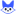
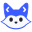

# Visual system

This page covers Covi's visual identity: the fox mascot, its tail, expressions, and animations, the mark and logo, the palette, the light and dark themes, typography, motion, the generated assets, and rules for using them. Everything here is defined in code in `packages/brand`: `tokens.ts` (the palette and themes), `mascot.ts` (the fox), `tail.ts` (the tail rig), `animation.ts` (the narrator's animations), `mark.ts` (the mark), and `logo.ts` with `wordmark.ts` (the logo). That package has no dependencies and runs both in Node and in the browser runtime that draws video frames.

## The fox

<p>
   in its ears and a play button at the end of its tail">
</p>

Covi's narrator is a blue fox, after the Arctic fox's blue morph: a fox that really is blue. It sits upright, facing you, its whole body in view. The round face and short muzzle of that fox, with round eyes, keep it reading as clever and honest, never sly; no expression narrows its eyes.

It is drawn from a handful of flat shapes, with no gradients, outlines, or texture:

- A head with cheek tufts, and a paper face mask whose arches over the eyes act as eyebrows.
- Ears with paper `<` `>` chevrons, so the fox listens to code.
- A body with a paper V bib and deep-cobalt front paws.
- A tail on the viewer's left. It ends in a round cap holding a paper disc with a cobalt rim and a ▶, upright at rest, so it reads as a play button. When the fox points, the tail sweeps out and the ▶ turns into an arrow (see [the tail](#the-tail)).

| Part | Light backgrounds | Dark backgrounds |
|---|---|---|
| Fur (head, ears, body, tail) | cobalt `#3B5BFF` | lifted cobalt `#6B84FF` |
| Front paws | deep cobalt `#2A43D1` | cobalt `#3B5BFF` |
| Face mask, bib, tail disc, ear chevrons | paper `#F8F9FB` | paper `#F8F9FB` |
| Eyes, nose, mouth | charcoal `#1F2430` | charcoal `#1F2430` |
| Eye highlights | white `#FFFFFF` | white `#FFFFFF` |
| Cheek blush (30% opacity) and the warning badge | accent `#FF9A4A` | accent `#FF9A4A` |

Every color is a palette token. Orange shows up only in small touches, and tests (`packages/brand/test/mascot.test.ts`) check that the fur color outweighs the accent in every expression and theme, and that the fox uses no color outside the palette. Videos draw the dark fox in the dark theme.

Every fox is drawn by one function, `foxSvg(options)`, on a 128×128 view box. Expressions and animations are all parameters, so the same code produces a static asset or one frame of a talking, blinking narrator. Each SVG has `role="img"` and a `<title>` such as "Covi the fox (reviewing)".

| Option | Range | Effect |
|---|---|---|
| `expression` | see below | Eyes, mouth, brows, head tilt, ear angle, default gaze, prop, and resting tail |
| `size` | px | Rendered width and height |
| `theme` | `light`, `dark` | The fur colors for the background the fox sits on (default `light`) |
| `blink` | 0–1 | 0 = eyes open, 1 = closed |
| `mouth` | 0–1 | 0 = the expression's resting mouth, above 0.05 an open talking mouth that grows with the value |
| `look` | x, y in −1…1 | Gaze direction: moves the pupils, and the head a little |
| `tilt` | degrees | Head rotation; overrides the expression's tilt |
| `ears` | degrees | Ear rotation, positive turns the ears outward; overrides the expression's ear angle |
| `brow` | `left`, `right`, `inner` | Eyebrow offsets in view-box units (positive lowers); overrides the expression's brows |
| `nod` | view-box units | How far the head dips (nods) |
| `bounce` | view-box units | Vertical offset of the whole fox (jolts) |
| `lean` | degrees | Whole-body lean about the feet, negative leans left |
| `reach`, `aim`, `curl`, `lift`, `wag`, `puff` | see [the tail](#the-tail) | The tail rig |
| `props` | boolean | Show the expression's prop (default true) |
| `propReveal` | 0–1 | How far the prop has appeared (default 1): thought dots appear one after another, badges scale in; values a little above 1 overshoot a pop |
| `blush` | boolean | Cheek blush (default true) |
| `frame` | rectangle | The part of the drawing the image shows (default the 128×128 box) |
| `colors`, `title`, `attributes` | | Color overrides (`fur`, `socks`, `mask`, `inner` for the ear chevrons, `ink`, `accent`, `highlight`), accessible title, extra attributes on the root `<svg>` (escaped) |

A pointing tail reaches past the 128×128 box. Inline SVG shows it (the root `<svg>` has `overflow="visible"`), but a standalone image clips to its view box, so the generated assets and `covi mascot` use `FOX_FRAME`, a frame with room for every expression's resting pose. `foxBounds(options)` returns where the fox actually is for a pose: an overall box, boxes for its parts (body, head, the tail in pieces, the prop), and the tail's boxes on their own. Video layout and QC use it instead of the narrator's box.

## The tail

The tail is a rig, not a set of drawn poses, so it can move wherever a moment needs it. Its parameters:

| Parameter | Range | Effect |
|---|---|---|
| `reach` | 0–1 | 0 = curled up beside the body, 1 = extended toward `aim` |
| `aim` | degrees or a point | Where the extended tip points: a screen angle (y down: 90 = down, 180 = left), or a point in view-box units the tip turns toward. The tail reaches from 100° to 245°; other directions get the nearest one it can reach. |
| `curl` | −1…1 | Looser or tighter bend |
| `lift` | 0–1 | Carries the tail higher and more open, the way a startled fox does |
| `wag` | −1…1 | Swings the tail about the hip and whips the tip after it |
| `puff` | 0–1 | The fur puffs up: the tail and its disc grow wider |

How it is built, and what keeps every combination of parameters a clean shape:

- The spine is an arc of fixed length whose curvature changes linearly along it, κ(s) = a + b·s/L, integrated from the hip. Every pose is a point in one continuous space of (start direction, length, a, b), so a blend of two poses is itself a smooth tail. (Blending Bézier control points between drawn poses produces kinks.)
- The curvature is clamped so the radius of curvature stays above the tail's half-width: the inner edge never folds.
- A width profile around the spine gives the outline. The base is hidden behind the body.
- The tail ends in a round cap: a semicircle that is part of the outline, since a separate circle leaves nubs where it joins. The paper disc is concentric with it, and the cap's rim stays fur.
- Wag and curl move the disc mostly down and out: the head sits just above and right of it, and the disc stays fully visible.
- On its way out, the tail turns toward the viewer mid-swing and reads a little shorter, so the sweep stays within the room its start and end take.
- The ▶ on the disc is upright at rest. As the tail extends, it turns to the tip's direction and becomes an arrowhead: longer, with a notch in its back. A tilted triangle has no readable direction.

Tests check, over a grid of every parameter, that the outline never folds or crosses itself, that the base stays behind the body, that the disc clears the head and body, and that the cap and disc stay concentric; and that the ▶ is upright at rest and points along the tip once extended.

## Expressions

<table>
  <tr>
    <td align="center"><br><code>neutral</code></td>
    <td align="center"><br><code>explaining</code></td>
    <td align="center"><br><code>thinking</code></td>
    <td align="center"><br><code>reviewing</code></td>
    <td align="center"><br><code>warning</code></td>
    <td align="center"><br><code>success</code></td>
  </tr>
</table>

| Expression | Face | Tail and prop | Used for |
|---|---|---|---|
| `neutral` | Round eyes, small smile | Curled; no prop | Static assets |
| `explaining` | Round eyes, open talking mouth, slight head tilt | Curled; no prop | The default for narrated scenes: context, what changed, the fix |
| `thinking` | One brow up, eyes up and to the right, head tilted, flat mouth | Curled; three thought dots | Problems and "before" states |
| `reviewing` | Focused brows, eyes on the content, flat mouth | Points at the content; no prop | Findings, and summaries of changes that need attention |
| `warning` | Wide eyes, small round mouth, ears turned out | Fur puffed up; orange badge with an exclamation mark | Serious findings, and summaries of changes that need changes |
| `success` | Closed, smiling eyes and a grin | Wags; cobalt check badge | Verified fixes and summaries of changes that look good |

In Covi's output the mascot appears only in videos. Markdown reports and PR/MR comments are text only.

How a video picks the expression for each scene:

- Storytelling templates (`templates/stories/*.yml`) give each beat an expression, `explaining` by default. See [video](video.md).
- When Covi drafts a storyboard, the review outcome can override the template: the review scene switches to `warning` when the verdict is "needs changes" or the top finding is high severity.
- On the summary card the verdict decides: `success` for looks good, `reviewing` for needs attention, `warning` for needs changes.
- Agents that write their own storyboard set `expression` per scene. The `covi-video` skill describes when to use each.

## Animations

The seven named animations are defined once, in `foxPose()` (`packages/brand/src/animation.ts`, listed in `ANIMATIONS`). It turns an expression, the scene time, the narration level, and where the content is into the fox's parameters. The video runtime draws both the narrator and the large title and summary foxes from it. Every animation is a pure function of the frame time and the seed: no clocks, no `Math.random`, no CSS animation, and no state carried from one frame to the next, so any frame can be rendered on its own and renders the same way every time (see [contributing](contributing.md#changing-video-components)). Tests in `packages/brand/test/mascot.test.ts` cover each one, and check that the tail moves continuously: nearby moments give nearby shapes.

| Animation | How it works |
|---|---|
| Blink | Blink times are scheduled from the timeline's seed. The first blink lands 1.4–2.9 s in, then one every 2.6–4.4 s. Each blink takes 0.18 s and follows a sine curve on `blink`. |
| Talk | `mouth` follows the narration audio. Covi takes the RMS level per video frame, normalizes it to the loud end of the take, gates silence, and smooths it with a fast attack and a slower release. Captions-only videos use a synthetic syllable rhythm during each scene's speech window instead. Loud syllables give the tail a small flick. |
| Look | Between 0.6 and 1.2 s into a content scene, the eyes move from the expression's resting gaze to the content, and the head turns a little with them: to the highlighted target when there is one, else down and to the left of the narrator. On title and summary cards the fox looks ahead. |
| Think | With `thinking`, the head sways ±2.5° around its −7° tilt, the eyes stay up and to the side, the tail slowly curls and uncurls, and the three thought dots appear one after another between 0.2 and 1.4 s. |
| Alert | With `warning`, the ears flick (±2.2°, fading over 0.8 s), the head jolts up briefly in the first 0.35 s, the tail's fur puffs up as the tail lifts, with a quick flick that dies away, and the orange badge pops in with a slight overshoot. |
| Approve | With `success`, the fox nods twice between 0.15 and 0.95 s and wags its tail while the check badge pops in. Videos of changes that look good end on it. |
| Point | On content scenes (code, screenshots, before/after, interactions, API calls, terminal output, findings, diagrams, change maps), the tail sweeps out once the content is on screen (0.8–1.6 s) and its ▶ turns into an arrow at the highlighted target: the highlighted lines, the focus box or click point (following the camera as it zooms, and gliding from step to step), the first finding, or the first changed node. With nothing highlighted, it points the way the eyes look. The body leans into it by only 1.5°. Screenshot and interaction scenes add a cursor that travels to the click point, a click ripple, and a focus ring around the changed region. |

When nothing else moves it, the tail sways a tiny amount on a phase set by the seed. Transitions between states are eased, never popped: within a scene every movement starts from the resting pose, and across a cut between two narrated scenes the narrator eases from the outgoing scene's pose to the incoming one's over the scene transition (the expression switches halfway, with the old prop shrinking away before the new one appears). The narrator also springs in when it appears (scale 0.9 → 1) and bobs gently (±1.2 px sine). On title cards the large fox springs from 0.82 → 1, except on a title card that opens the video, which is in place from the first frame.

### The outro

Every video ends on the stacked logo, brought to life (see [Video](video.md#the-outro)). The fox from the summary card is the same fox that signs off: it glides from its place beside the summary to center stage over 0.6 s, its face easing from the verdict's expression to the calm `neutral` smile while the badge shrinks away. It glances down as `covi` writes itself in beneath it, letter by letter, each rising a third of its x-height. At 1 s the card settles: the fox looks back at the viewer, the cobalt ▶ over the `i` lands with a small overshoot, and the tail gives one flick that dies away; the music's sonic logo lands on the same moment. One unhurried blink follows, and nothing else moves. The verdict chip and the sign-off line ("Reviewed with Covi") sit centered under the logo in the summary's colors.

The lockup keeps the stacked logo's proportions: the fox's 128-unit box is 1.364 times the word's width, centered over it, 2% of the box above the ▶. The fox box is 40% of the frame's short side (60% on vertical video, which has room to spare), and the group is centered in the frame. With `video.mascot: false`, the wordmark is drawn larger, alone over the row. The outro never shows `success` or `warning`: the verdict is in the chip, and the fox signs off calm.

### The narrator in the frame

The narrator sits at the top right of the header band, clear of the media region and the caption band. It is the largest square that fits both the column the header leaves free on its right and the band between the progress bar and the media region, with 8 units to spare: 190 units on vertical video and 150 on square video (their whole columns), and 142 on landscape video (the band's height), where a unit is 1/1080 of the frame's short side. The box sits 4 view-box units into the side margin, because the resting tail curls a couple of units past the left edge of the fox's 128×128 box. The narrator is hidden on title cards and summary scenes, which show a larger fox of their own; a title set over a capture (a cold open) keeps it. With `video.mascot: false`, no fox appears at all.

The tail may leave the narrator's box only into empty space: never over the header's text, the captions, the progress bar, or the media region. When the direction to the target would cover any of them, on the way out or once extended, the narrator takes the nearest direction that doesn't, up to 45° away. Past that the arrow would point at something else, so the tail stays curled and the eyes do the pointing. Whatever the tail is doing (pointing, the alert's puff and lift, a wag), each frame it eases back toward rest just far enough to stay clear. Video QC measures the fox as drawn, tail included, with `foxBounds`, and warns when it covers demonstrated content, the media region, captions, or header text (`narrator-clear-of-content`).

## Palette

| Token | Hex | Role |
|---|---|---|
| `cobalt` | `#3B5BFF` | Identity: the fox's fur and the primary color in the light theme (eyebrows, progress bar, highlights) |
| `cobaltDeep` | `#2A43D1` | The fox's front paws; function names and object keys in code shown on light cards |
| `cobaltLight` | `#6B84FF` | Cobalt lifted for dark backgrounds: the dark theme's primary, the dark fox's fur, the logo's ▶ on dark |
| `sky` | `#EAF0FF` | Soft surfaces, the light app tile, the light theme's `primarySoft` |
| `charcoal` | `#1F2430` | Text, the fox's features, the logo wordmark, the dark app tile |
| `graphite` | `#4A5163` | Muted text in the light theme, comments in code on light cards |
| `line` | `#D9DEEA` | Borders and progress-bar tracks in the light theme |
| `paper` | `#F8F9FB` | Light background, the fox's mask, bib, ear chevrons, and tail disc, the dark logo's wordmark |
| `white` | `#FFFFFF` | Light-theme surfaces (cards), eye highlights |
| `accent` | `#FF9A4A` | Optional warm accent for small highlights only: blush, the warning badge, the "Needs attention" verdict chip, likely-issue markers, warning callouts |
| `success` | `#16A06A` | Looks-good verdicts, added-line counts |
| `danger` | `#E5484D` | Needs-changes verdicts, confirmed-issue markers, removed-line counts |
| `addBg` | `#E6F6EE` | Added lines on light cards (the light theme's `surfaceAdd`) |
| `addFg` | `#127A4B` | Strings in code on light cards |
| `delBg` | `#FDECEC` | Removed lines on light cards (the light theme's `surfaceDel`) |

Cobalt carries identity, charcoal carries text, and the warm accent stays small.

## Themes

Videos render in a light theme (the default) or a dark theme. Set `video.theme` in [configuration](configuration.md), pass `--theme light|dark` to `covi video` or `covi render`, or say "dark mode" in a `--request`.

| Role | Light | Dark |
|---|---|---|
| Background | `#F8F9FB` | `#12151C` |
| Surface / alternate surface | `#FFFFFF` / `#EAF0FF` | `#1C212C` / `#242B3A` |
| Text / muted text | `#1F2430` / `#4A5163` | `#EEF1F8` / `#A3AAB9` |
| Lines | `#D9DEEA` | `#2F3646` |
| Primary / primary soft | `#3B5BFF` / `#EAF0FF` | `#6B84FF` / `#242B4A` |
| Accent | `#FF9A4A` | `#FF9A4A` |
| Success / danger | `#16A06A` / `#E5484D` | `#2CC489` / `#FF6B70` |
| Code background / text / muted | `#161A23` / `#E6E9F2` / `#7D8599` | `#0D1016` / `#E6E9F2` / `#6E7689` |
| Captions | paper text on charcoal at 92% opacity | `#F8F9FB` on near-black at 90% opacity |

Code, diff, and terminal panels are dark in both themes, with translucent green and red line backgrounds (`addBackground`, `delBackground`). In the dark theme, cobalt is lifted to `#6B84FF` (`cobaltLight`) so it keeps contrast against the dark background, and the fox follows: lifted fur and cobalt paws. Frames have a faint dot grid on the background.

API responses sit on the theme's own cards instead, so they get their own diff tints and syntax colors:

| Token | Light | Dark |
|---|---|---|
| `surfaceAdd` / `surfaceDel` (changed lines) | `addBg` `#E6F6EE` / `delBg` `#FDECEC` | translucent green / translucent red |
| `surfaceSyntax` (code on cards) | darker colors, at least 4.5:1 on both tints | same as `syntax` |
| `syntax` (code on the code panel) | the code-panel colors below | the code-panel colors below |

| Syntax role | Code panel (`syntax`) | Light cards (`surfaceSyntax`) |
|---|---|---|
| Keyword | `#C792EA` | `#7A3FD1` |
| String | `#A5E075` | `#127A4B` (`addFg`) |
| Number | `#F9AE58` | `#A1520B` |
| Comment | `#7D8599` | `#4A5163` (`graphite`) |
| Function, property | `#82AAFF`, `#89DDFF` | `#2A43D1` (`cobaltDeep`) |
| Type | `#FFCB6B` | `#8A6100` |

The video timeline carries the whole theme (`Theme` from `packages/brand`) to the browser runtime, so every frame is drawn with these tokens and nothing else.

## Typography

| Use | Stack |
|---|---|
| Text | `'Inter Variable', Inter, -apple-system, 'Segoe UI', Helvetica, Arial, sans-serif` |
| Code, paths, terminals | `'JetBrains Mono Variable', 'JetBrains Mono', ui-monospace, SFMono-Regular, Menlo, Consolas, monospace` |

Video compositions embed both variable fonts as WOFF2 files from the `@fontsource-variable/inter` and `@fontsource-variable/jetbrains-mono` packages, with `font-display: block`, so a frame never renders in a fallback font. The embedded files cover the Latin subset. Korean, Japanese, and Chinese text uses Noto Sans KR, JP, and SC (`@fontsource-variable/noto-sans-kr`, `-jp`, `-sc`), placed right after the first family of both stacks; a composition embeds only the unicode-range slices its text uses, and the video's language decides which one draws Han characters. Other scripts fall back to system fonts. Inter uses the `cv11` and `ss01` features. Monospace text turns ligatures off.

Text styles:

- Headings are weight 720 with slightly tight tracking.
- Eyebrows are uppercase cobalt at weight 700 with wide tracking and a leading dot.
- Captions are weight 640 on a rounded dark pill.
- All text sizes scale with the frame's layout unit.

## Motion

`motion` in `tokens.ts` holds the video's motion timings:

| Token | Value | Use |
|---|---|---|
| `transition` | 0.45 s | The default scene transition (a fade), and the outro's fade |
| `transitions` | fade 0.45 s, cut 0, push 0.5 s, wipe 0.55 s, zoom-through 0.6 s | Each scene transition's length. All stay under 0.625 s, so an ordinary scene ends at most 0.6 s after its line |
| `drift` | 0.02 | A capture's camera drift through its scene |
| `linger` | 0.02 | The push-in on a visual that has settled while its line continues |
| `punch` | 0.06 | The hero's camera punch, and the most the camera ever pushes in |
| `flash` | 0.18 s at 35% | The hero's white flash |

How they move (`packages/video/src/runtime/transitions.ts` and `camera.ts`, pure functions of the frame time):

- **Transitions.** A storyboard scene chooses how it enters. `fade`: the incoming scene fades in while rising, and the outgoing one fades out while drifting up. `cut`: no transition at all. `push`: the new scene slides in from the right as the old one leaves to the left. `wipe`: the new scene is uncovered from left to right over the old one. `zoom-through`: the old scene grows away as it fades, and the new one settles in from 92%; it is the hero's default. The narrator eases from one scene's pose to the next over the transition. The video's first scene has no entrance: it is in place at frame 0.
- **The camera.** Each scene's media layer (not its header) scales about the center of the media region. Captures (screenshots, before/after, interactions, and a title set over a capture) drift in by 2% through the whole scene on a sine ease. Any other visual pushes in by 2% from the moment its own choreography settles to the end of the scene, when its line is still going, so no picture holds still under narration. Title and summary cards push their text panel instead, so the fox the outro takes over never moves. `camera: "static"` stops both.
- **The hero accent.** At the hero's `hero` phase the camera punches in 6% (in over 0.1 s, out by 0.6 s), a white flash peaks at 35% and is gone within 0.18 s, and one ring in the primary color expands over 0.7 s around what the scene highlights. The flash and the ring are clipped to the media region, so they never cover the header or the captions. The camera never pushes past 6%, which keeps the media region's content clear of the caption band.
- **Caption emphasis.** The phrase marked `[[…]]` in a line is swept with a primary-color marker as it is spoken.
- Elements enter with opacity plus a short upward drift on an ease-out cubic curve, staggered in reading order. Screenshot scenes zoom to the changed region, spotlight it, then move the cursor and click, at the moments the storyboard's `sync` pins to the narration, or at fixed fractions of the scene without it.
- The fox moves on damped springs and eased curves. The summary fox uses an overshoot ease.

Motion supports the explanation and never decorates. There are no CSS transitions or animations: the composition stylesheet disables them, and every value is computed from the frame time.

## Mark and logo

The mark is the fox's head alone, with wider cheek tufts than the full fox so its silhouette still reads as a fox when small. Its detail steps down with size, because what reads at 64 px turns to noise at 16. `foxMarkSvg({ size })` picks the level from the size, or takes `level` directly:

| Level | Sizes | Detail |
|---|---|---|
| `micro` | 24 px and below | No ear chevrons; bigger eyes and nose; taller ears and even wider cheek tufts |
| `small` | 32–48 px | The `<` `>` chevrons in the ears |
| `full` | 64 px and up | Eye highlights and the smile as well |

| Asset | Preview | Use |
|---|---|---|
| `fox-mark-16.svg` |  | Favicons and other icons at 24 px and below |
| `fox-mark-32.svg` |  | Icons at 32–48 px |
| `fox-mark.svg` |  | The mark at 64 px and up |
| `fox-tile-sky.svg` |  | App icons and avatars: the mark on a rounded sky tile |
| `fox-tile-charcoal.svg` |  | The same on a charcoal tile, with the dark fox |
| `logo.svg` |  | The head mark and the lowercase `covi` wordmark in charcoal, for light backgrounds |
| `logo-dark.svg` | (paper wordmark) | The same with the dark mark, a paper wordmark, and a `#6B84FF` ▶, for dark backgrounds |
| `logo-stacked.svg` |  | The seated fox above the wordmark |
| `logo-stacked-dark.svg` | (paper wordmark) | The stacked logo for dark backgrounds |

The wordmark is Inter Bold set as outlines, not live text, so it looks the same everywhere. Its `i` is dotted with a cobalt ▶ (`#6B84FF` on dark backgrounds). The outlines are stored as source data in `packages/brand/src/wordmark.ts`, taken from Inter (SIL Open Font License 1.1) as shipped in `@fontsource-variable/inter`, at weight 700. `logoSvg({ height, theme, layout })` draws the lockups: `layout: 'horizontal'` (default) puts the head mark beside the word, and `layout: 'stacked'` puts the seated fox above it. Horizontal logos 24 px tall and under use the `micro` mark.

## Generated assets

`assets/covi/` holds fifteen generated SVG files:

- `fox-<expression>.svg` for each of the six expressions (256 px, framed by `FOX_FRAME` so a pointing tail is never clipped)
- `fox-mark.svg` (64 px), `fox-mark-32.svg`, and `fox-mark-16.svg`
- `fox-tile-sky.svg` and `fox-tile-charcoal.svg` (128 px)
- `logo.svg` and `logo-dark.svg` (64 px tall), `logo-stacked.svg` and `logo-stacked-dark.svg` (220 px tall)

They are derived files. Change `packages/brand/src` (or `tokens.ts`), then regenerate:

```bash
npm run assets                             # rewrites assets/covi/*.svg and removes ones no longer generated
node scripts/generate-assets.ts --check    # exits 1 and names stale or leftover files
```

The brand test runs the same comparison, so `npm test` fails while the committed assets are stale.

## Exporting with the CLI

`covi mascot` writes an SVG to stdout, or to a file with `--out`. `--size` takes a whole number of pixels from 16 to 4096 (default 256); anything else is a usage error (exit 2).

```bash
covi mascot                                      # neutral fox, 256 px
covi mascot --expression reviewing --size 128 --out reviewing.svg
covi mascot --mark --size 32 --out favicon.svg   # the head mark, with the detail for 32 px
covi mascot --logo --size 256 --out logo.svg     # head mark and wordmark, 128 px tall (half of --size)
```

The fox is framed with `FOX_FRAME`, like the generated assets. The CLI exports the light logo and the mark for light backgrounds. For the dark and stacked logos and the app tiles, use the files in `assets/covi/`, or call `logoSvg({ theme: 'dark', layout: 'stacked' })` and `foxMarkSvg({ background, theme })` from `packages/brand`.

## Usage rules

Do:

- Let cobalt carry identity and charcoal carry text. Use paper and sky for surfaces.
- Keep the warm accent small: a badge, a chip, a blush. Never fill large areas with it.
- Pick the expression by meaning. Use `success` only when the verdict is "looks good" or a fix has been shown to work, and `warning` for serious findings.
- Use the mark at icon sizes, at the level made for that size (`fox-mark-16.svg` for favicons).
- Make variations with `foxSvg` parameters, the tail rig included, instead of editing SVG by hand.
- Keep the narrator in its header slot, and its tail in empty space, clear of the product being demonstrated.

Don't:

- Recolor the fox orange, or let orange outweigh cobalt.
- Add realism: fur texture, gradients, outlines, or extra props.
- Narrow the fox's eyes or give it a sly look.
- Stretch or skew the fox or the logo.
- Show `success` on a change that needs work. The summary card maps the verdict to the expression for this reason.
- Edit `assets/covi/*.svg` directly. They are regenerated from code.
